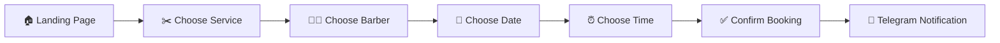
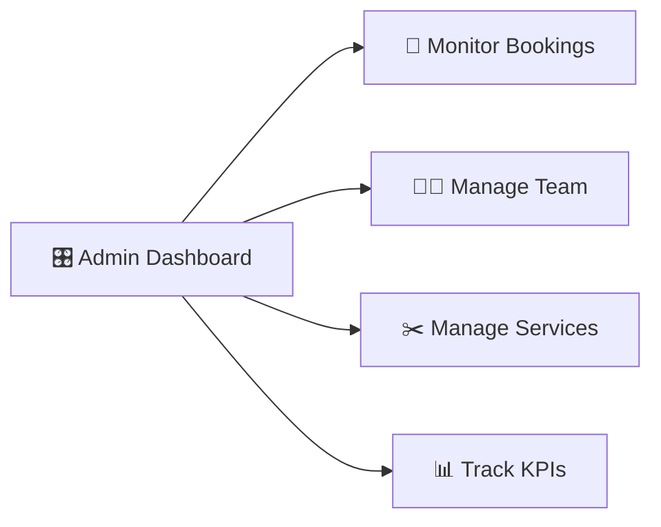

# ✂️ TopGun Barbershop — Booking SaaS

<div align="center">

### **Premium Barbershop Experience. Reinvented.**

A modern full-stack booking platform designed to make appointments effortless for clients and business management effortless for barbershops.

<br/>

**📅 Book Online · ✂️ Meet Your Barber · 🔔 Never Miss an Appointment**

<br/>

[](https://react.dev/)
[](https://vitejs.dev/)
[](https://tailwindcss.com/)
[](https://nodejs.org/)
[](https://expressjs.com/)
[](https://www.mongodb.com/)

</div>

---

## 🖤 The Experience

**TopGun Barbershop** combines a premium customer-facing experience with a powerful management system behind the scenes.

Instead of phone calls, waiting lines and manual scheduling, clients can book their appointment in just a few steps.

Meanwhile, the barbershop gets a centralized workspace for managing appointments, specialists, services and business performance.

```text
                    TOPGUN BARBERSHOP

        ┌──────────────────────────────────────┐
        │                                      │
        │          ✂️  PREMIUM EXPERIENCE      │
        │                                      │
        │     Discover → Choose → Book         │
        │                                      │
        └──────────────────┬───────────────────┘
                           │
              ┌────────────┴────────────┐
              │                         │
              ▼                         ▼
        👤 CLIENT                  🎛️ ADMIN
              │                         │
        Book appointment          Manage business
        View barbers              Track bookings
        Connect Telegram          Manage team
        View history              Manage services
              │                         │
              └────────────┬────────────┘
                           │
                           ▼
                    🍃 MongoDB Atlas
```

---

# ✨ What Makes It Different

This isn't just a booking form.

It's a complete digital experience built around the way a modern barbershop actually works.

### 📅 Instant Booking

Clients can find an available specialist and book a suitable time without calling the barbershop.

### 👨‍💼 Personal Barber Selection

Every specialist has their own profile, rating, specialization, working schedule and portfolio.

### 🟢 Real Availability

The interface clearly shows whether a barber is currently available or has a day off.

### 🤖 Telegram Notifications

Clients can connect Telegram and receive appointment-related notifications directly in the messenger.

### 🎛️ Business Control Center

Administrators get a dedicated dashboard for monitoring bookings, revenue, staff and services.

### 🔐 Secure Accounts

Authentication, protected access and password recovery are built directly into the platform.

---

# 🖥️ Product Preview

<div align="center">

### 🏠 Landing Page

</div>

```text
╭──────────────────────────────────────────────────────────────────────╮
│ ●  ●  ●     topgunbarbershop.com                              ─ □ × │
├──────────────────────────────────────────────────────────────────────┤
│                                                                      │
│  TOPGUN                                    Services  Barbers  About  │
│                                             Contacts        BOOK NOW │
│                                                                      │
│  🟢 Open Today • 9:00 — 21:00                                      │
│                                                                      │
│             YOUR STYLE.                                             │
│             YOUR BARBER.                                            │
│             YOUR TIME.                                              │
│                                                                      │
│       Premium grooming without the waiting.                         │
│                                                                      │
│       [ BOOK AN APPOINTMENT ]                                       │
│                                                                      │
│       ⚡ Instant 24/7 Booking      ✓ No Waiting Lines               │
│                                                                      │
│  ────────────────────────────────────────────────────────────────    │
│                                                                      │
│       FEATURED SPECIALISTS                                          │
│                                                                      │
│       [ Barber ]       [ Barber ]       [ Barber ]                  │
│       ★ 4.9            ★ 5.0            ★ 4.9                       │
│                                                                      │
╰──────────────────────────────────────────────────────────────────────╯
```

<div align="center">

### 📅 Booking Experience

</div>

```text
╭──────────────────────────────────────────────────────────────────────╮
│ ●  ●  ●     topgunbarbershop.com/book                         ─ □ × │
├──────────────────────────────────────────────────────────────────────┤
│                                                                      │
│                     BOOK YOUR APPOINTMENT                           │
│                                                                      │
│              ① Service     ──     ② Barber     ──     ③ Time       │
│                                                                      │
│   SELECT A SERVICE                                                   │
│                                                                      │
│   ┌────────────────────────────────────────────────────────────┐     │
│   │  ✂️  Classic Haircut                              $25       │     │
│   │      Clean cut & styling                         45 min     │     │
│   │                                                            │     │
│   │                                    [ SELECT → ]             │     │
│   └────────────────────────────────────────────────────────────┘     │
│                                                                      │
│   ┌────────────────────────────────────────────────────────────┐     │
│   │  🧔  Beard & Shaving                              $18       │     │
│   │      Precision beard grooming                     30 min    │     │
│   │                                                            │     │
│   │                                    [ SELECT → ]             │     │
│   └────────────────────────────────────────────────────────────┘     │
│                                                                      │
╰──────────────────────────────────────────────────────────────────────╯
```

<div align="center">

### 🎛️ Admin Control Panel

</div>

```text
╭──────────────────────────────────────────────────────────────────────╮
│ ●  ●  ●     topgunbarbershop.com/admin                         ─ □ × │
├──────────────────────────────────────────────────────────────────────┤
│                                                                      │
│  TOPGUN ADMIN                                      👤 Administrator  │
│                                                                      │
│  BUSINESS OVERVIEW                                                   │
│                                                                      │
│  ┌──────────────┐ ┌──────────────┐ ┌──────────────┐ ┌────────────┐ │
│  │ EST. REVENUE │ │ APPOINTMENTS │ │ CONFIRMATION │ │ TEAM       │ │
│  │              │ │              │ │              │ │            │ │
│  │   $12,450    │ │     248      │ │     100%     │ │   8 / 14   │ │
│  │   Avg $50     │ │   All Time   │ │  Confirmed   │ │  Team/Services│
│  └──────────────┘ └──────────────┘ └──────────────┘ └────────────┘ │
│                                                                      │
│  [ All Time ] [ This Month ] [ 7 Days ]                    [ SYNC ] │
│                                                                      │
│  [ BOOKINGS MONITOR ] [ SERVICES ] [ BARBER TEAM ]                 │
│                                                                      │
│  Client       Service          Specialist      Date       Status    │
│  ─────────────────────────────────────────────────────────────────  │
│  John Smith   Classic Haircut  Alex            10:30      CONFIRMED │
│  Mike Brown   Beard & Shaving  Daniel          12:00      CONFIRMED │
│  David Lee    Combo Package    Michael         14:30      CANCELLED │
│                                                                      │
╰──────────────────────────────────────────────────────────────────────╯
```

> The browser-style previews above represent the product experience. Actual application screenshots can be placed in this section as the project evolves.

---

# 🎨 Design Language

## Gentlemen Lounge

The entire interface follows a **premium dark aesthetic** inspired by modern luxury barbershops.

### Visual identity

```text
        DARK
         │
         ▼
   ┌──────────────┐
   │              │
   │  GENTLEMEN   │
   │    LOUNGE    │
   │              │
   └──────────────┘
         │
         ├── Deep dark backgrounds
         ├── Subtle gradient borders
         ├── Amber / gold accents
         ├── Premium cards
         └── Smooth interactive elements
```

### Accent Color

**#FFB800 — Amber Gold**

Used for important actions, booking buttons, highlights and key interface elements.

The goal is a UI that feels:

**Premium · Masculine · Modern · Focused**

---

# 🏠 Public Experience

## Header

The top navigation immediately communicates the state of the barbershop.

```text
TOPGUN

🟢 Open Today • 9:00 — 21:00

Services & Prices
Barbers
About Us
Contacts

[ Admin Panel ] [ Book Now ] [ Profile ]
```

Clients can immediately:

* Check whether the barbershop is open
* Browse services
* Meet the barbers
* Open their profile
* Start booking

---

# ⚡ Hero Section

The first screen focuses on one goal:

> **Get the client booked.**

The hero combines:

* Strong headline
* Quick benefits
* Featured specialists
* Popular services
* Direct booking action

### Quick Benefits

**⚡ Instant 24/7 Online Booking**

**✓ No Waiting Lines**

### Popular Categories

`Haircut` · `Beard & Shaving` · `Combo Package` · `Facial & Care`

---

# ✂️ Meet Our Specialists

The barber section lets clients choose the right specialist before booking.

### Filters

```text
[ ALL MASTERS ]     [ TOP RATED 4.9+ ]
```

### Barber Cards

Every specialist card contains:

* 📸 Photo
* 👤 Name
* 🏷️ Position
* ✂️ Specialization
* ⭐ Rating
* 💬 Number of reviews
* 🟢 Current availability
* 📖 Portfolio

Example:

```text
┌─────────────────────────────┐
│                             │
│          BARBER             │
│                             │
│     Alex Johnson            │
│     ★ 4.9 · 128 reviews     │
│                             │
│     Senior Barber           │
│     Haircuts & Styling      │
│                             │
│     🟢 Available             │
│                             │
│     [ Book with Alex ]      │
│     [ View Portfolio ]      │
│                             │
└─────────────────────────────┘
```

---

# 🗓️ Smart Days Off

The booking experience automatically reflects each barber's schedule.

### Available

```text
🟢 AVAILABLE

[ Book with Alex ]
```

### Day Off

```text
🔴 OFF TODAY

[ Off Today ]
```

When a specialist has a day off, booking is automatically disabled for that day.

This prevents clients from attempting to schedule appointments when the specialist isn't working.

---

# 📖 Barber Lookbook

Every barber can showcase their work through a personal portfolio.

Clients can open:

**`View Portfolio (Lookbook)`**

and explore examples of that specialist's work before booking.

This turns the booking process into more than selecting a free time — clients can select a **style and specialist they actually like**.

---

# ✂️ Services & Prices

The service catalog provides a clean overview of everything the barbershop offers.

Example services include:

* ✂️ Classic Haircut
* 🧔 Beard & Shaving
* 👨‍👦 Father & Son Combo
* 💆 Scalp Detox & Massage
* ⭐ Combo Packages
* 🧴 Facial & Care

Every service includes:

```text
SERVICE
───────
Description
Price
Duration
```

The duration is especially important because it is used when calculating available booking slots.

---

# 🔐 Authentication

Customers can create an account and securely sign in using:

```text
Email
+
Password
```

Authentication is handled with JWT-based access control.

The platform supports different user roles and protected areas of the application.

---

# 🔑 Forgot Password

The password recovery experience is designed to be simple for the client.

```text
Forgot Password
       ↓
Enter Email
       ↓
Receive Reset Email
       ↓
Open Secure Link
       ↓
Create New Password
       ↓
Account Restored ✓
```

Reset links use a limited lifetime of **15 minutes**.

The actual reset token is securely handled through the backend rather than exposing sensitive credentials.

---

# 👤 Client Profile

The client profile is organized around three simple areas.

```text
┌──────────────────────────────────────────┐
│                                          │
│   UPCOMING   │   HISTORY   │   MY INFO   │
│                                          │
└──────────────────────────────────────────┘
```

### 📅 Upcoming

Shows current appointments with relevant booking details.

### 🕘 History

Displays previous visits including:

* Service
* Date
* Status

### 👤 My Info

Personal account information.

---

# 🤖 Telegram Connection

Clients can connect their Telegram account directly from their profile.

### Never Miss Your Barber Appointment

```text
┌─────────────────────────────────────────┐
│                                         │
│   NEVER MISS YOUR                       │
│   BARBER APPOINTMENT                    │
│                                         │
│   Receive important appointment         │
│   notifications directly in Telegram.  │
│                                         │
│        [ CONNECT TELEGRAM ]             │
│                                         │
└─────────────────────────────────────────┘
```

After connecting, Telegram can be used for appointment-related notifications such as:

* ✓ Confirmation
* 🔄 Changes
* ❌ Cancellation
* ⏰ Reminders

---

# 🎛️ Admin Control Panel

The admin panel transforms the platform from a booking page into a complete business management tool.

## 📊 KPI Analytics

The top of the dashboard provides an instant overview of business performance.

### EST. REVENUE

Displays estimated revenue and average check.

### TOTAL APPOINTMENTS

Shows the total number of bookings.

### CONFIRMATION RATE

Displays the percentage of confirmed appointments.

### TEAM & OFFERINGS

Shows:

```text
8 Specialists
14 Active Services
```

---

# 📅 Bookings Monitor

The booking monitor gives administrators a complete overview of appointments.

### Filters

```text
[ Search Client / Phone / Service ]

[ All Dates ] [ All Statuses ] [ Newest ]

                                      [ Export ]
```

### Booking Table

| Client Details | Service         | Specialist | Date & Time      | Price | Status       |
| -------------- | --------------- | ---------- | ---------------- | ----- | ------------ |
| John Smith     | Classic Haircut | Alex       | Today · 10:30    | $25   | 🟢 CONFIRMED |
| Mike Brown     | Beard & Shaving | Daniel     | Today · 12:00    | $18   | 🟢 CONFIRMED |
| David Lee      | Combo Package   | Michael    | Tomorrow · 14:30 | $40   | 🔴 CANCELLED |

Administrators can update booking statuses directly from the table.

---

# 🧑‍💼 Barber Team

The admin panel also provides complete staff management.

Administrators can manage:

* Barber profiles
* Specializations
* Services
* Availability
* Working days
* Days off
* Portfolio content

This makes the team section a central place for managing the people behind the business.

---

# 🧰 Services Management

Administrators can manage the complete service catalog.

Each service can have:

```text
Name
Description
Price
Duration
```

Changes to the catalog are reflected in the customer-facing booking experience.

---

# 🧭 Product Flow

The complete customer journey can be summarized in one flow:



And the business journey:



---

# 🛠️ Tech Stack

Only the technologies used to build the platform.

### Frontend

* ⚛️ **React 18**
* ⚡ **Vite**
* 🎨 **Tailwind CSS**
* 📡 **Axios**
* 🧩 **Lucide React**

### Backend

* 🟢 **Node.js**
* 🚂 **Express.js**
* 🔐 **JWT**
* 🔒 **bcryptjs**
* 📧 **Nodemailer**

### Database

* 🍃 **MongoDB Atlas**
* 🐍 **Mongoose**

### Integrations

* 🤖 **Telegram Bot API**
* 📧 **SMTP**

### Deployment

* ▲ **Vercel** — Frontend
* 🚀 **Render** — Backend
* 🍃 **MongoDB Atlas** — Database

---

# 💡 Built Around Real Business Needs

The platform was designed around actual barbershop workflows rather than isolated technical features.

```text
                    CLIENT
                      │
                      ▼
              Find a Service
                      │
                      ▼
               Choose a Barber
                      │
                      ▼
              Find Available Time
                      │
                      ▼
                 Book Visit
                      │
                      ▼
             Receive Notification
                      │
                      ▼
                  VISIT ✓


                    BUSINESS
                      │
                      ▼
               Monitor Bookings
                      │
                      ▼
                Manage Team
                      │
                      ▼
              Manage Services
                      │
                      ▼
                 Track KPIs
```

Every part of the interface is built around keeping this flow **simple, visual and fast**.

---

# 🖤 The Result

**TopGun Barbershop** brings the entire customer and business experience into one platform.

### For clients

**Discover → Choose → Book → Get Notified → Visit**

### For the business

**Monitor → Manage → Organize → Track → Grow**

---

<div align="center">

## ✂️ TOPGUN BARBERSHOP

### **Your Style. Your Barber. Your Time.**

<br/>

**Premium booking experience for modern barbershops.**

<br/>

`React 18` · `Vite` · `Tailwind CSS` · `Node.js` · `Express.js` · `MongoDB Atlas`

</div>

