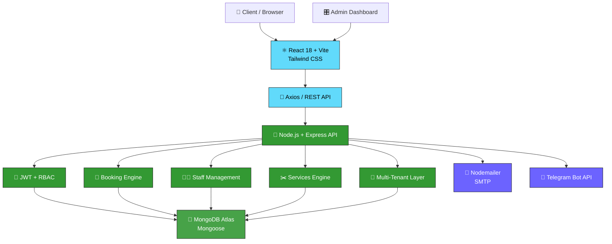

# ✂️ Booking SaaS — Online Booking & Business Management Platform

<div align="center">

### 🚀 A modern multi-tenant SaaS platform for appointment-based businesses

**Book smarter. Manage easier. Automate everything.**

[](https://react.dev/)
[](https://vitejs.dev/)
[](https://nodejs.org/)
[](https://expressjs.com/)
[](https://www.mongodb.com/)
[](https://jwt.io/)
[](https://tailwindcss.com/)

</div>

---

## 🌐 Overview

**Booking SaaS** is a full-stack appointment management platform designed for:

* 💈 Barbershops
* 💇 Beauty salons
* ✂️ Individual specialists
* 🏢 Service-based businesses

The platform allows customers to book appointments while giving businesses a centralized system for managing **staff, services, schedules, bookings, customers and notifications**.

The application is built around a **multi-tenant architecture**, meaning multiple independent businesses can operate on the same platform while keeping their data completely isolated.

---

# ⚡ Core Features

| Feature                           | Description                               |
| --------------------------------- | ----------------------------------------- |
| 🏢 **Multi-Tenancy**              | Isolated data for every business          |
| 📅 **Smart Booking**              | Dynamic availability calculation          |
| 🛡️ **Double Booking Protection** | Prevents overlapping appointments         |
| 👨‍💼 **Staff Management**        | Profiles, services and schedules          |
| ✂️ **Services Engine**            | Flexible pricing and duration             |
| 🔐 **RBAC**                       | Superadmin, admin, staff and client roles |
| 📧 **Password Recovery**          | Secure email-based reset flow             |
| 🤖 **Telegram Bot**               | Instant booking notifications             |
| 🎛️ **Admin Dashboard**           | Complete business management              |
| 📊 **Business Analytics**         | Bookings, visits and revenue              |
| 📱 **Responsive UI**              | Desktop, tablet and mobile                |

---

# 🏗️ Architecture

The application follows a modular **MERN architecture**.

## 🔥 System Architecture



### 🔄 Request Lifecycle

```text
┌──────────────┐
│   Browser    │
└──────┬───────┘
       │
       ▼
┌──────────────┐
│    React     │
└──────┬───────┘
       │ Axios
       ▼
┌──────────────┐
│   Express    │
└──────┬───────┘
       │
       ├──────────────► 🔐 Authentication
       │
       ├──────────────► 🏢 Tenant Validation
       │
       ├──────────────► 📅 Business Logic
       │
       ▼
┌──────────────┐
│   MongoDB    │
└──────────────┘
       │
       ├──────────────► 📧 Email
       │
       └──────────────► 🤖 Telegram
```

---

# 🏢 Multi-Tenancy

The platform uses `tenantId` to isolate business data.

Every important resource belongs to a specific tenant:

```text
Tenant
├── Users
├── Staff
├── Services
├── Clients
├── Bookings
└── Settings
```

For example:

```javascript
{
  _id: "...",
  tenantId: "tenant_123",
  name: "Premium Haircut",
  price: 5000,
  duration: 60
}
```

A request belonging to one business cannot access resources belonging to another tenant.

This allows the application to scale from:

```text
1 Business
     ↓
10 Businesses
     ↓
100 Businesses
     ↓
1000+ Businesses
```

without creating a separate application for every business.

---

# 📅 Smart Booking Engine

The booking flow is intentionally simple for customers.

### 1️⃣ Choose a Service

Customers select a service and see:

* Name
* Description
* Price
* Duration

### 2️⃣ Choose a Specialist

Customers can select a specialist based on:

* Avatar
* Name
* Bio
* Rating
* Available services

### 3️⃣ Choose Date & Time

Available slots are calculated dynamically using:

* Service duration
* Specialist schedule
* Working days
* Days off
* Existing bookings
* Current time
* Specialist availability

---

## 🛡️ Double Booking Prevention

The server does not blindly trust the frontend.

Before creating a booking, the backend verifies whether the requested time overlaps with an existing appointment.

```text
New Booking
     │
     ▼
Find Specialist
     │
     ▼
Check Working Day
     │
     ▼
Check Availability
     │
     ▼
Check Existing Bookings
     │
     ▼
Check Time Overlap
     │
 ┌───┴────┐
 ▼        ▼
FREE     BUSY
 │        │
 ▼        ▼
CREATE   REJECT
```

This makes the booking engine resilient against race conditions and accidental duplicate bookings.

---

# 🧠 Engineering Challenges & Solutions

This project wasn't built around simple CRUD operations.

Several parts required solving real backend and database engineering problems.

---

## 🧩 Challenge #1 — Preventing Duplicate Bookings

### Problem

Two customers can theoretically attempt to book the same specialist and overlapping time at nearly the same moment.

A simple frontend check is not enough.

### Solution

The backend performs server-side conflict validation and verifies the requested interval against existing appointments.

```javascript
const hasConflict = await Booking.exists({
  barberId,
  date,
  startTime: { $lt: requestedEnd },
  endTime: { $gt: requestedStart }
});
```

If a conflict exists:

```http
409 Conflict
```

is returned instead of creating the appointment.

### Result

The booking engine remains protected even when multiple requests arrive simultaneously.

---

# 🗄️ Challenge #2 — MongoDB Compound Indexes

### Problem

The booking collection needs efficient querying while avoiding invalid uniqueness constraints.

A naive unique compound index can create unexpected conflicts when optional fields are missing.

For example:

```javascript
{
  tenantId: 1,
  barberId: 1,
  date: 1,
  startTime: 1
}
```

A normal unique index may not behave correctly when documents do not contain all indexed fields.

### Solution

A **partial index** can limit the index to documents that actually satisfy the required conditions.

```javascript
bookingSchema.index(
  {
    tenantId: 1,
    barberId: 1,
    date: 1,
    startTime: 1
  },
  {
    unique: true,
    partialFilterExpression: {
      barberId: { $exists: true },
      date: { $exists: true },
      startTime: { $exists: true }
    }
  }
);
```

### Why this matters

This allows MongoDB to enforce uniqueness where it is meaningful without unnecessarily constraining unrelated documents.

> **Database constraints belong in the database layer — not only in the frontend.**

---

# 🧱 Challenge #3 — Tenant Isolation

### Problem

In a SaaS application, authentication alone isn't enough.

A valid user could potentially request another tenant's resource if the API only checks the user's role.

### Solution

Every protected request is evaluated against both:

```text
User Identity
      +
Tenant Identity
      +
Resource Ownership
```

Example:

```javascript
const booking = await Booking.findOne({
  _id: bookingId,
  tenantId: req.user.tenantId
});
```

This ensures that:

```text
Tenant A ❌ → Tenant B data
Tenant B ❌ → Tenant A data
Tenant A ✅ → Tenant A data
```

---

# 🔐 Challenge #4 — Authentication & Authorization

### Problem

Different users need completely different levels of access.

### Solution

The system combines **JWT authentication** with **role-based access control**.

```text
superadmin
   │
   ├── Full platform access
   │
admin
   │
   ├── Own tenant
   │
staff
   │
   └── Own schedule
       
client
   │
   └── Own bookings
```

Authorization is enforced at the API layer.

---

# 📧 Challenge #5 — Password Reset Reliability

Password recovery uses short-lived, single-use reset tokens.

```text
Forgot Password
      ↓
Generate Token
      ↓
Store Expiration
      ↓
Send Email
      ↓
15 Minute Lifetime
      ↓
Validate Token
      ↓
Update Password
      ↓
Invalidate Token
```

The reset process is intentionally isolated from the normal authentication flow.

---

# 🤖 Challenge #6 — External Integrations

The platform communicates with external services such as:

* 📧 SMTP
* 🤖 Telegram Bot API
* 🍃 MongoDB Atlas

External services can fail independently from the main application.

Therefore, notification logic is separated from the core booking flow wherever possible.

The goal is:

```text
Booking succeeds
      │
      ├────► Telegram notification
      │
      └────► Email notification
```

A temporary notification failure should not necessarily destroy an otherwise valid booking.

---

# 🖥️ Terminal / API Preview

The API can be tested directly from a terminal.

### Create a booking

```bash
curl -X POST http://localhost:5000/api/bookings \
  -H "Authorization: Bearer <JWT_TOKEN>" \
  -H "Content-Type: application/json" \
  -d '{
    "serviceId": "64abc123",
    "barberId": "64def456",
    "date": "2026-08-20",
    "startTime": "14:00"
  }'
```

### Response

```json
{
  "success": true,
  "message": "Booking created successfully",
  "booking": {
    "_id": "66abc123",
    "date": "2026-08-20",
    "startTime": "14:00",
    "endTime": "15:00",
    "status": "confirmed"
  }
}
```

### Conflict example

```json
{
  "success": false,
  "message": "This time slot is already booked"
}
```

```text
HTTP 409 Conflict
```

---

# 🔑 Authentication Preview

### Login

```bash
curl -X POST http://localhost:5000/api/auth/login \
  -H "Content-Type: application/json" \
  -d '{
    "email": "admin@example.com",
    "password": "********"
  }'
```

### Response

```json
{
  "success": true,
  "token": "eyJhbGciOiJIUzI1NiIs...",
  "user": {
    "id": "64abc123",
    "role": "admin",
    "tenantId": "tenant_123"
  }
}
```

---

# 🎨 Browser Mockups

Instead of displaying plain screenshots, the interface can be presented as browser-style product previews.

## 📊 Admin Dashboard

```text
╭──────────────────────────────────────────────────────────────╮
│ ●  ●  ●     booking-saas.app/admin/dashboard                 │
├──────────────────────────────────────────────────────────────┤
│                                                              │
│  Booking SaaS                         🔔  👤 Admin            │
│                                                              │
│  ┌──────────┐ ┌──────────┐ ┌──────────┐ ┌──────────┐        │
│  │ 📅 24    │ │ 👥 156   │ │ 💰 $2.4K │ │ ✂️ 12    │        │
│  │ Bookings │ │ Clients  │ │ Revenue  │ │ Staff    │        │
│  └──────────┘ └──────────┘ └──────────┘ └──────────┘        │
│                                                              │
│  Today's Schedule                                            │
│  ─────────────────────────────────────────────────────────   │
│                                                              │
│  10:00  Alex Johnson       Haircut             Confirmed     │
│  11:30  Michael Brown      Beard Trim          Confirmed     │
│  13:00  Daniel Smith       Haircut + Beard     Pending       │
│                                                              │
╰──────────────────────────────────────────────────────────────╯
```

## 📅 Booking Wizard

```text
╭──────────────────────────────────────────────────────────────╮
│ ●  ●  ●     booking-saas.app/book                            │
├──────────────────────────────────────────────────────────────┤
│                                                              │
│                  BOOK YOUR APPOINTMENT                       │
│                                                              │
│       ① Service  ─── ② Specialist ─── ③ Time                │
│                                                              │
│  ┌──────────────────────────────────────────────────────┐    │
│  │ ✂️ Premium Haircut                                   │    │
│  │                                                      │    │
│  │ 60 min                              $25               │    │
│  │                                                      │    │
│  │ Professional haircut and styling                     │    │
│  └──────────────────────────────────────────────────────┘    │
│                                                              │
│                   [ Continue → ]                             │
│                                                              │
╰──────────────────────────────────────────────────────────────╯
```

## 👨‍💼 Staff Management

```text
╭──────────────────────────────────────────────────────────────╮
│ ●  ●  ●     booking-saas.app/admin/staff                     │
├──────────────────────────────────────────────────────────────┤
│                                                              │
│  Staff Management                         [ + Add Staff ]    │
│                                                              │
│  ┌────────┬──────────────┬────────────┬──────────┬────────┐ │
│  │ Avatar │ Name         │ Services   │ Schedule │ Status │ │
│  ├────────┼──────────────┼────────────┼──────────┼────────┤ │
│  │  👨    │ Alex Johnson │ 5 services │ Mon-Sat  │ 🟢     │ │
│  │  👨    │ Daniel Smith │ 3 services │ Mon-Fri  │ 🟢     │ │
│  │  👨    │ Mark Wilson  │ 4 services │ Tue-Sat  │ 🔴     │ │
│  └────────┴──────────────┴────────────┴──────────┴────────┘ │
│                                                              │
╰──────────────────────────────────────────────────────────────╯
```

### 📸 Real Screenshots

When screenshots are available, replace the mockups above with actual application previews:

```markdown
<p align="center">
  
</p>

<p align="center">
  
</p>
```

---

# 📁 Project Structure

```text
booking-saas/
│
├── client/
│   ├── src/
│   │   ├── components/
│   │   ├── pages/
│   │   ├── layouts/
│   │   ├── hooks/
│   │   ├── services/
│   │   ├── context/
│   │   └── App.jsx
│   │
│   ├── public/
│   └── package.json
│
├── server/
│   ├── controllers/
│   ├── models/
│   ├── routes/
│   ├── middleware/
│   ├── services/
│   ├── utils/
│   ├── config/
│   ├── bot/
│   ├── server.js
│   └── package.json
│
├── screenshots/
│   ├── dashboard.png
│   ├── booking.png
│   ├── staff.png
│   └── services.png
│
├── .gitignore
└── README.md
```

---

# 🛠️ Tech Stack

### Frontend

* ⚛️ React 18
* ⚡ Vite
* 🎨 Tailwind CSS
* 📡 Axios
* 🧩 Lucide React

### Backend

* 🟢 Node.js
* 🚂 Express.js
* 🔐 JWT
* 🔒 bcryptjs
* 📧 Nodemailer

### Database

* 🍃 MongoDB Atlas
* 🐍 Mongoose

### Integrations

* 🤖 Telegram Bot API
* 📧 SMTP

### Deployment

* ▲ Vercel — Frontend
* 🚀 Render — Backend
* 🍃 MongoDB Atlas — Database

---

# ⚙️ Environment Variables

Create a `.env` file inside the backend directory:

```env
PORT=5000

MONGO_URI=your_mongodb_connection_string

JWT_SECRET=your_jwt_secret_key

# Superadmin
ADMIN_EMAIL=admin@gmail.com
ADMIN_PASSWORD=your_admin_password

# SMTP / Nodemailer
EMAIL_HOST=smtp.gmail.com
EMAIL_PORT=587
EMAIL_USER=your_email@gmail.com
EMAIL_PASS=your_app_password

# Telegram
TELEGRAM_BOT_TOKEN=your_telegram_bot_token
```

> ⚠️ Never commit `.env` files or production secrets to GitHub.

Add them to `.gitignore`:

```gitignore
.env
node_modules/
dist/
```

---

# 🚀 Getting Started

## 1. Clone the repository

```bash
git clone https://github.com/your-username/booking-saas.git

cd booking-saas
```

## 2. Install backend dependencies

```bash
cd server
npm install
```

## 3. Configure environment variables

Create:

```text
server/.env
```

and configure your MongoDB, JWT, SMTP and Telegram credentials.

## 4. Start the backend

```bash
npm run dev
```

Backend:

```text
http://localhost:5000
```

## 5. Install frontend dependencies

Open another terminal:

```bash
cd client
npm install
```

## 6. Start the frontend

```bash
npm run dev
```

Frontend:

```text
http://localhost:5173
```

---

# 🔌 API Overview

```text
/api/auth
/api/users
/api/tenants
/api/barbers
/api/services
/api/bookings
/api/dashboard
```

The API follows a REST-oriented architecture with protected endpoints for authenticated users.

---

# 🔐 Security

The application includes:

* 🔑 JWT authentication
* 🔒 bcrypt password hashing
* 👥 Role-based access control
* 🏢 Tenant-level isolation
* ⏱️ Expiring password-reset tokens
* 🛡️ Backend authorization
* 🚫 Double-booking prevention
* 🔐 Environment-based secrets

For production environments, additional measures such as HTTPS, rate limiting, request validation, secure token storage and restrictive CORS configuration should be enabled.

---

# 📈 Roadmap

* [ ] 💳 Online payments
* [ ] 📊 Advanced analytics
* [ ] 📱 PWA / Mobile application
* [ ] 🔔 Push notifications
* [ ] 📆 Google Calendar integration
* [ ] 💬 WhatsApp notifications
* [ ] ⭐ Customer reviews
* [ ] 🎁 Loyalty system
* [ ] 🧾 Automated receipts
* [ ] 🌍 Multi-language support
* [ ] 🏪 Public business pages
* [ ] 📈 Advanced staff analytics

---

# 🧪 Engineering Highlights

This project demonstrates practical experience with:

```text
┌─────────────────────────────────────────────┐
│              FULL-STACK ENGINEERING         │
├─────────────────────────────────────────────┤
│                                             │
│  ⚛️  React & Component Architecture         │
│  🚂  REST API Design                        │
│  🔐  Authentication & Authorization         │
│  🏢  Multi-Tenant Architecture              │
│  🍃  MongoDB Data Modeling                   │
│  🧩  Compound & Partial Indexes             │
│  📅  Scheduling & Availability Logic         │
│  🛡️  Conflict Detection                    │
│  📧  Email Integration                      │
│  🤖  Telegram Bot Integration               │
│  ☁️  Cloud Deployment                       │
│                                             │
└─────────────────────────────────────────────┘
```

The project goes beyond basic CRUD by solving problems related to **data isolation, scheduling, database constraints, authentication, external integrations and reliability**.

---

# 📊 Project Complexity

```text
Frontend
████████████████████░░  85%

Backend
█████████████████████░  90%

Database
██████████████████░░░  80%

Authentication
███████████████████░░  85%

Booking Logic
█████████████████████  95%

Integrations
████████████████░░░░░  70%
```

> The goal is not to maximize the number of features, but to build each core feature around real business requirements.

---

# 🤝 Contributing

Contributions, suggestions and improvements are welcome.

```bash
git checkout -b feature/amazing-feature

git add .

git commit -m "feat: add amazing feature"

git push origin feature/amazing-feature
```

Then open a Pull Request.

---

# 📄 License

This project is available under the **MIT License**.

---

<div align="center">

## ✂️ Built for modern service businesses.

### Book. Manage. Automate. Grow. 🚀

**Full-Stack MERN · Multi-Tenant · Scalable · Production-Oriented**

</div>
